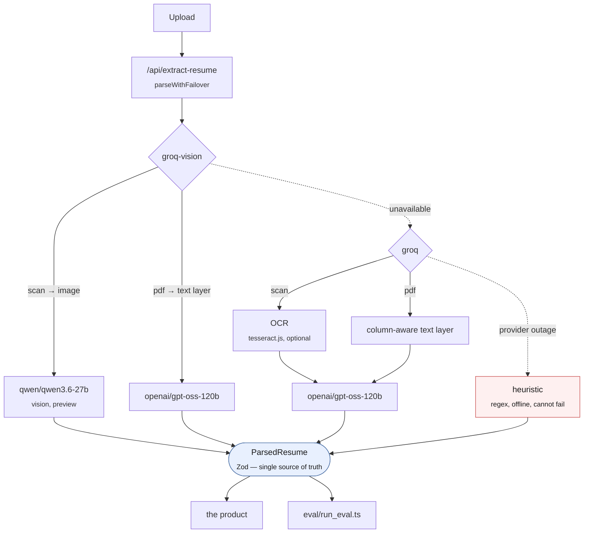
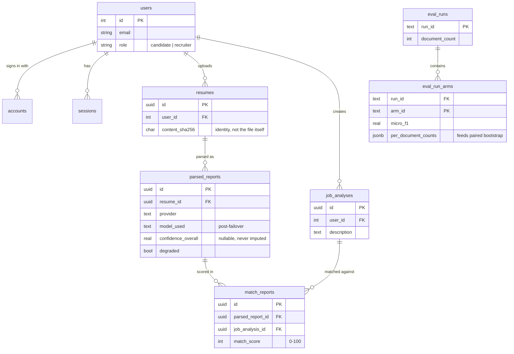

# SkillParser — AI resume screening, with an evaluation to back it up

SkillParser extracts structured data from resumes (PDF, DOCX, scanned images) and
scores candidates against a job description. It runs on Next.js 15 with a
provider-agnostic extraction layer over Groq — a text model for documents, a vision
model for scans — plus an offline rule-based fallback that needs no network.

The part worth looking at first is not the extraction. It is **[`eval/`](eval/)** —
a labelled corpus, a scoring harness, an error taxonomy, and a calibration analysis,
all reproducible from a fresh clone. Every reported number ships with a bootstrap
confidence interval and a rule-based baseline it has to beat, rather than a single
headline figure. The rendered result lives at **`/eval`**; the methodology is in
[`eval/README.md`](eval/README.md).

---

## Quick start

```bash
npm install
cp .env.example .env        # add GROQ_API_KEY (https://console.groq.com/keys)
npm run groq:check          # confirm your key can reach the configured models
npm run dev                 # http://localhost:9002
```

`groq:check` is worth running before anything else. Groq retires models faster than
most providers — the Llama 3.2 vision previews went in April 2025, Llama 4 Scout and
Maverick during 2026 — and it asks the API what your key can actually see rather than
trusting a hard-coded id.

Evaluation:

```bash
npm run eval:corpus         # regenerate 60 records × 4 conditions from checked-in labels
npm run eval:test           # 106 offline tests of the harness — no API key needed
npm run eval                # run every configured arm, rebuild the report and /eval
```

Arms whose API keys are absent are skipped with a message, so a clone with no keys
still produces a complete report from the offline arms.

---

## How extraction is evaluated

Full methodology in [`eval/README.md`](eval/README.md). The short version:

**The corpus is built backwards.** A structured record is generated first and the
document is rendered *from* it, so every label is correct by construction and no
real personal data is involved — which is why this dataset can live in a public
repository at all. 60 records, each rendered in a 2×2 factorial of
{single-column, two-column} × {digital, scanned}, so layout and modality vary with
the content held constant.

**The cost of that is realism.** Generated resumes are cleaner than real ones.
Scores here are an **upper bound**; the deltas between arms are the measurement, not
the absolute level. That sentence appears next to every headline number rather than
in a footnote.

**Every number carries its uncertainty.** Bootstrap confidence intervals resampled
over documents (not field instances — those are correlated within a resume and would
give intervals several times too narrow), and paired bootstrap tests for every
A-vs-B claim.

**Failures are recorded, not scored.** A document a provider could not process is
marked unscored, never counted as an extraction that got everything wrong.
Otherwise reliability leaks into accuracy and the two become inseparable.

**There is a baseline.** A rule-based parser — regex and section segmentation, no
model, no network — runs as an arm of the experiment. An LLM reporting 0.9 F1 has
said nothing until you know what a hundred lines of regex scores on the same
documents.

**Failures are categorised.** Missing field, hallucinated field, reading-order
bleed, OCR corruption, truncation, entry split, entry merge, and more — because two
systems with the same F1 can fail in opposite ways, and in a hiring tool a
fabricated skill is far more dangerous than a missing one.

**Model confidence is checked.** Discrimination (AUROC) and calibration (ECE,
reliability diagram) are reported separately, because a model can have one without
the other, and which one it has decides whether the score is usable as a probability
or only for routing low-confidence extractions to human review.

---

## Architecture



Solid arrows are the normal path; dotted arrows are failover, walked only when the
step above it fails. `degraded: true` in the response marks the dotted path all the
way to `heuristic`.

**The app and the harness share one code path.** Same provider interface, same
prompt builder, same retry policy. When those diverge, the eval measures something
the product does not do and the reported accuracy quietly stops applying.

### Providers

| | `groq-vision` | `groq` | `heuristic` |
|---|---|---|---|
| Model | `qwen/qwen3.6-27b` (scans) + text model | `openai/gpt-oss-120b` | none |
| Reads a scan natively | yes | no — OCR first | no — OCR first |
| Reads a PDF | text layer | text layer | text layer |
| Token budget enforced | yes | yes | n/a |
| Cost | list price | list price | CPU only |

`groq-vision` is a superset of `groq`: it differs only in where images go. That is
the modality ablation, and running it inside one vendor is a cleaner experiment than
comparing across vendors — endpoint, retry policy, token budgeting and prompt are all
held constant, so a difference between the two arms is the modality rather than two
companies' unrelated engineering.

The vision model is the only image-capable model Groq exposes and it is listed as
**preview**, so it can be withdrawn at short notice. When that happens the arm
reports itself unconfigured, scans fall back to the OCR path, and the report says so
— rather than the run failing.

### Failover

The original chain walked Gemini model versions (2.5-flash → 1.5-flash → 1.5-pro
with exponential backoff). That code is preserved exactly — Gemini still works and is
one line of config away — but it is no longer in the default path. The chain is now
`groq-vision → groq → heuristic`: past a withdrawn vision model to the OCR path, and
past a Groq outage to a parser that never leaves the machine.

That last hop is a product decision worth stating. An upload during an outage returns
a degraded extraction rather than an error page, and `degraded: true` in the response
tells the UI to say so. Silently serving regex output as if it were model output
would be the wrong trade.

### Token budgeting

Groq screens a request as `prompt_tokens + max_tokens` against the per-minute
ceiling — 8,000 on the free tier, and the same 8,000 for every model in the table, so
dropping to a smaller model buys no headroom. The reply reservation and the prompt
budget are therefore two halves of one number. Prompts are trimmed to fit before the
call using weighted sections with redistribution of unused allowance, against a
deliberately pessimistic 3 chars/token estimate.

The vision path cannot trim: you cannot truncate half a page away and still call the
result a reading of the document. So it checks whether the instructions plus the reply
reservation leave room for an image at all, and raises a configuration error up front
if they do not.

The load-bearing detail: **an oversized request is classified as non-retryable.**
Groq's own wording for a 413 contains the phrase "tokens per minute", so a rate-limit
rule evaluated first matches it — and then the caller spends its entire retry budget
on backoff before failing with the same error minutes later. `classifyProviderError`
checks the oversized markers first, and there is a test pinning the exact provider
string.

---

## Security

All API keys are read from the environment (`.env`, gitignored) — none are
hardcoded in source. `.env.example` documents every variable the app reads.

---

## Data & authentication layer

Persistence and authentication are designed and implemented at the code level, ahead
of the packages and infrastructure that run them — the schema, the data-access
layer, and the Auth.js configuration below are what `npm run build` wires in once
`next-auth`, `pg`, and `@auth/pg-adapter` are installed and a `DATABASE_URL` is set.

| File | What it is |
|---|---|
| `supabase/migrations/0001_init.sql` | Postgres schema — Auth.js tables (`users`, `accounts`, `sessions`, `verification_token`), `resumes` (stores a `content_sha256`, never the file itself), `parsed_reports` (provider, model, tokens, cost, latency, degraded flag, failover trail — every extraction becomes a re-analysable row, not just a log line), `job_analyses`, `match_reports`, `eval_runs` / `eval_run_arms`. RLS is enabled on every table as defense-in-depth; authorization itself is enforced in application code via explicit `user_id` filtering. |
| `src/lib/db/client.ts` | Connection pool (cached on `globalThis` so Next.js hot-reload doesn't leak a pool per edit), `query`/`queryOne`/`transaction` helpers, and `tryPersist()` — a wrapper so a database failure degrades gracefully instead of breaking extraction. |
| `src/lib/db/reports.ts` | Data-access layer: `saveExtraction` (transactional — a resume row is never left without its extraction), `listHistory`, `getReport`, `listRevisions`, `deleteReport`, `modelUsageStats`. |
| `src/auth.ts` | Auth.js v5 configuration (GitHub + Google), with three-stage graceful degradation: no OAuth/no DB → app still works, nothing remembered; OAuth only → sign-in works with JWT sessions, no history; both configured → database sessions and persistent history. |
| `src/app/api/auth/[...nextauth]/route.ts` | Route handler for the config above. |

The schema, drawn from the migration file:



`accounts`, `sessions`, and `verification_token` are the `@auth/pg-adapter` tables,
reproduced verbatim rather than in house style, and are omitted from the diagram —
see the migration file's own comments for why they can't be renamed.

**Setup:** `npm i next-auth@beta pg @auth/pg-adapter`, point `DATABASE_URL` at a
Postgres instance (a free Supabase project works), run the migration, and add
`AUTH_SECRET` plus a GitHub or Google OAuth app's credentials to `.env`. See the
[Roadmap](#roadmap) for what's next after that — wiring `saveExtraction()` into the
extract route and gating the dashboard behind a session.

---

## Commands

| | |
|---|---|
| `npm run dev` | Dev server on :9002 |
| `npm run build` | Production build |
| `npm run typecheck` | `tsc --noEmit` |
| `npm run eval:corpus` | Regenerate the evaluation corpus from checked-in labels |
| `npm run eval:test` | Offline test suite (no network, no API key) |
| `npm run eval` | Run the evaluation and rebuild the report |
| `npm run groq:check` | List the models this API key can actually reach |
| `npm run genkit:dev` | Genkit developer UI |

### Environment

| Variable | Required | Notes |
|---|---|---|
| `GROQ_API_KEY` | yes | <https://console.groq.com/keys> |
| `GROQ_MODEL` | no | Text model. Default `openai/gpt-oss-120b` |
| `GROQ_VISION_MODEL` | no | Vision model for scans. Default `qwen/qwen3.6-27b` (preview) |
| `GROQ_TPM_LIMIT` | no | Default 8000. Confirm yours at <https://console.groq.com/settings/limits> |
| `RESUME_COMPLETION_TOKENS` | no | Reply reservation, default 2000 |
| `RESUME_PROVIDER_CHAIN` | no | Default `groq-vision,groq,heuristic` |
| `TESSERACT_LANG_PATH` | no | Local `eng.traineddata` for offline OCR |
| `GEMINI_API_KEY` | no | Only if you add `gemini` back to the chain |

---

## What the product does

1. **Job description analysis** — distils a JD into required skills, experience and
   qualifications.
2. **Resume extraction** — contact details, skills, experience, education and
   certifications from PDF, DOCX or scanned images, with per-field confidence.
3. **Semantic match scoring** — 0–100 with an explanation, matched skills and gaps,
   rather than keyword overlap.
4. **Talent pool and history** — shortlisting for recruiters, match history for
   candidates.

## Stack

Next.js 15 (App Router) · TypeScript · Zod · Genkit · Groq (`gpt-oss-120b`,
`qwen3.6-27b` vision) · Tailwind · shadcn/ui · Firebase

---

## Roadmap

- Finish installing and wiring the Postgres + Auth.js layer described above:
  install the packages, stand up a database, run the migration, and connect
  `saveExtraction`/`listHistory` to the actual extract route and UI.
- Gate history and the dashboard behind a session while leaving single-resume
  parsing usable without login.
- A side-by-side model comparison view for a single resume, backed by
  `modelUsageStats()`.
- Remove the now-superseded `localStorage`-based login and the dead Firebase
  scaffolding once the database layer is live.
- A held-out set of real resumes, annotated by hand and kept out of git, to measure
  how far the synthetic scores transfer.
- Continuation for oversized replies on the Groq path, so output length is decoupled
  from the per-minute ceiling rather than bounded by it.
