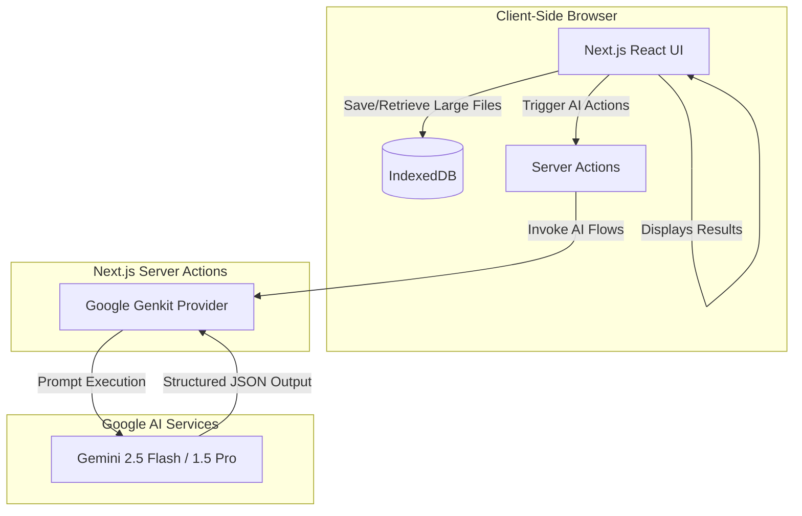
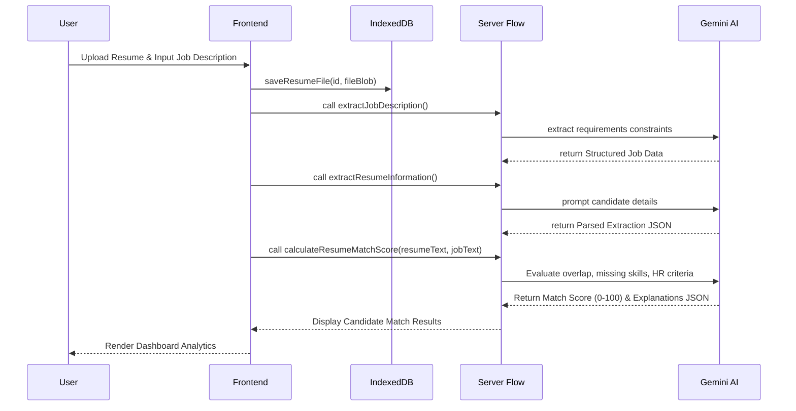
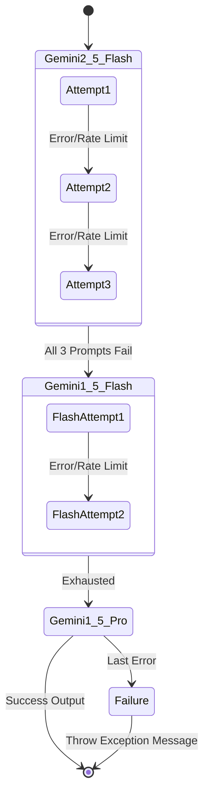

# System Architecture and Flow Diagrams

The following sections detail the system architecture and processing flows designed for the AI-Powered Resume Matcher project. These diagrams and accompanying explanations can be directly added to your project report.

## 1. High-Level System Architecture

The project is structured around a modern web stack, utilizing Next.js for both the client and server components, IndexedDB for robust client-side storage, and Google Genkit for LLM-based capabilities.

### Description
The High-Level Architecture separates concerns into a robust client interface and an AI-driven backend layer.
- **Client layer**: Next.js handles the front-end rendering. Because resumes can be large binary files (PDFs, DOCX), storing them in `localStorage` is not feasible. The architecture elegantly solves this by utilizing **IndexedDB** as an asynchronous local storage engine for candidate resumes.
- **Server Actions**: Instead of traditional REST endpoints, Next.js Server Actions establish a direct, secure bridge from the client state to the backend logic.
- **Genkit AI**: The backend utilizes the Genkit framework to define declarative "flows" and "prompts." We leverage schema-enforced JSON outputs (via `zod`) to ensure that the generative model (Gemini) responds with strictly formatted candidate data instead of raw text.

---

## 2. Resume Processing & Matching Flow

This sequence diagram illustrates the step-by-step lifecycle of parsing a resume and calculating a match score against a job description.

### Description
The Resume Matching flow is an asynchronous pipeline orchestrated to maintain UI responsiveness:
1. The user provides a resume file and a job description.
2. The file is temporarily cached in IndexedDB. 
3. The system fires off modular AI flows: one dedicated to parsing the requirements of the job description, and one parsing the candidate's skills, work history, and education.
4. Finally, the "Calculation" flow fuses both parsed datasets. The model acts as an expert HR recruiter, generating a definitive score (0-100), explicitly identifying matched skills, and crucially, pointing out missing skills.

---

## 3. Resilient AI Execution with Self-Healing Fallback

A critical feature of production-ready AI applications is handling rate limits and API service disruptions. 

### Description
Because the application relies heavily on third-party AI APIs (Google Genkit), it implements an **Exponential Backoff and Fallback** pattern.
- If the primary model (`gemini-2.5-flash`) faces a 429 Rate Limit or transient failure, the system automatically waits.
- The wait time grows exponentially between retries.
- If the primary model exhausts its three attempts, the system dynamically swaps the engine to `googleai/gemini-1.5-flash`, and subsequently `gemini-1.5-pro` as an ultimate safety net. This ensures high availability and robustness for end-users, guaranteeing that no resume analysis fails silently.
