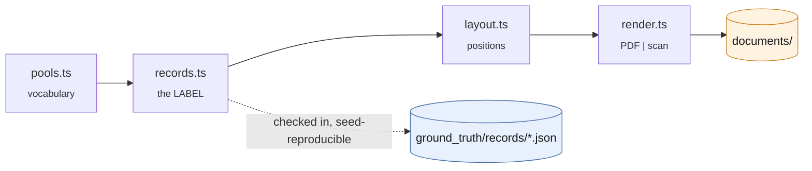
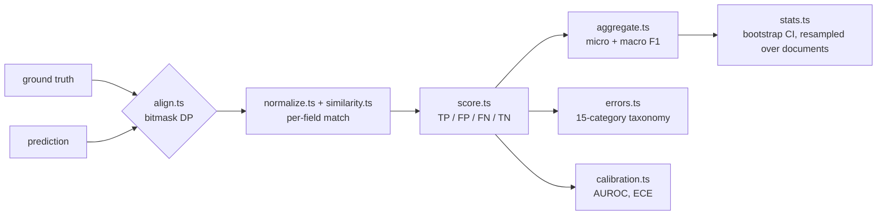

# Evaluation methodology

This directory is the answer to a question any reviewer should ask about a resume
parser: **how do you know?**

The short version: a labelled corpus of synthetic resumes, a harness that scores
every extraction field by field, bootstrap confidence intervals on every number, a
taxonomy that says *how* each failure failed, a calibration analysis of the model's
own confidence, and a rule-based baseline that every model arm has to beat before
its accuracy means anything.

Everything here runs from a fresh clone. The labels are checked in; the documents
regenerate from them byte-identically.

```bash
npm run eval:corpus     # regenerate 60 records × 4 conditions from the checked-in labels
npm run groq:check      # what can this key actually reach?
npm run eval:test       # 106 offline tests of the harness itself — no API key needed
npm run eval            # run every configured arm and rebuild the report
```

Output lands in `eval/results/` (run artifacts and a markdown report) and
`src/lib/eval/latest-report.json` (the summary rendered at `/eval`).

---

## 1. The corpus is built backwards

The usual way to build an extraction dataset is to collect documents and annotate
them. That is expensive, slow, produces labels that are themselves noisy, and — for
resumes specifically — produces a pile of personal data that cannot be published.
"I anonymised it" is not much of a defence when the employment history is intact.

So this corpus is generated **label-first**: a structured record is synthesised, and
the document is rendered *from* that record.



The record — the label — is generated first and checked into git. Everything to its
right is a deterministic function of it plus a seed, so `npm run eval:corpus` on a
fresh clone reproduces `documents/` byte-for-byte without ever re-deciding what the
"correct" answer is.

| | |
|---|---|
| **Bought** | Labels correct by construction, so no inter-annotator agreement to report. Zero personal data, so the corpus can live in a public repository. Arbitrary size. Controlled variation along the axes that matter. Byte-identical regeneration from a seed. |
| **Paid** | Generated resumes are cleaner and more internally consistent than real ones. They lack the genuinely ambiguous cases — a title that wraps in a way no rule resolves, a table that is really a layout hack, a bare "2019–2021" floating between two sections. |

**Scores on this corpus are an upper bound on real-world accuracy.** The report says
so next to the headline number, not in a footnote. The intended reading is
comparative: arm A against arm B under identical conditions, where the delta is the
measurement and the absolute level is a ceiling.

### The 2×2 factorial

Every record is rendered in all four cells:

|                | digital (PDF) | scanned (JPEG) |
|----------------|---------------|----------------|
| single-column  | ✓             | ✓              |
| two-column     | ✓             | ✓              |

Layout and modality therefore vary **with the content held constant**, which is what
makes "column interleaving costs N F1 points, and OCR multiplies that" a measurement
rather than a comparison of two different piles of documents.

`manifest.primarySplit` also defines a balanced one-condition-per-record assignment
(15 documents per cell) so routine runs cost a quarter of the API budget.
`--condition=all` opts into the full factorial.

### The two-column emission order is the point

A two-column PDF can store its text in either of two orders. **Column-major** —
everything in the left column, then everything in the right — extracts cleanly with
any tool and makes the two-column condition nearly as easy as one column.
**Row-major** — line by line across both columns, the way a layout engine walking a
visual grid emits it — interleaves the columns in the content stream, so a naive
extractor hands the model `Principal Engineer  Erlang / Quintaline Systems  Chaos
engineering`.

Row-major is what a large share of real templates produce, and it is the case that
distinguishes a good preprocessor from a bad one. This generator emits row-major on
purpose. Building it the other way would have produced much better-looking numbers
and measured nothing.

### The scan simulation

Six independently parameterised stages, all seeded, applied to the same layout the
digital condition uses:

1. **Skew** (±1.3°) — feeder misalignment; breaks horizontal-projection line finding.
2. **Illumination gradient** — a page that did not lie flat; defeats a single global threshold.
3. **Optical blur** (0.3–0.7 px) — cheap glass; closes the counters of small type.
4. **Sensor noise** — additive Gaussian per pixel.
5. **Speckle** — dust on the platen.
6. **JPEG** at quality 0.58–0.78 — ringing around glyph edges.

Ranges are tuned so a person can read the page with mild effort. Harder and every
provider fails equally, which measures nothing; easier and the scanned condition
stops differing from the digital one.

### Deliberate difficulty

Making a corpus easy is the most common way to manufacture a high accuracy number,
so the generator includes the cases that actually break parsers:

- **Unconventional section headings** on a third of the corpus — "WHERE I'VE
  WORKED", "TOOLBOX", "SCHOOLING". This is the single most discriminative axis. A
  rule-based parser segments on a fixed vocabulary and simply cannot find these; a
  language model reads the heading and understands it. Without it the rule-based
  baseline saturates near 0.97 and the whole comparison stops discriminating.
- **Five entry-header arrangements**, including right-aligned dates on the same
  visual line as the title.
- **Four date notations**, and `Present` / `Current` / `now` end dates.
- **Names that defeat `Firstname Lastname`**: hyphenation, diacritics, particles
  (`van der Meulen`), ALL-CAPS convention.
- **Adversarial content**: ~10% with no education section, ~35% with no
  certifications, some with no phone, some new-grads with no employment history,
  and promotion cases — two roles at one employer — that invite entry merging.
- **Distractors**: summary prose, project sections, and header lines that resemble
  contact details (`github.com/…`, `References available on request`) but belong to
  no label, so a parser that grabs the first URL-ish thing it sees is caught doing
  it and scored as a hallucination.

### What is checked in

| Path | In git | Why |
|---|---|---|
| `ground_truth/records/*.json` | yes | The dataset. Small and diffable. |
| `ground_truth/manifest.json` | yes | Index, split assignment, SHA-256 per document. |
| `ground_truth/documents/*` | no | ~20 MB of derived binaries; regenerate with `npm run eval:corpus`. |
| `results/history/*.summary.json` | yes | Aggregated per-run summary, ~40 KB. Keeps per-document counts, so a future run can be paired-tested against this one without re-calling any model. |
| `results/reports/*.md` | yes | Rendered reports. |
| `results/runs/*.json` | no | Full artifacts with every field observation — a few MB each. Right thing on disk, wrong thing to accumulate in git. |
| `results/cache/` | no | Raw provider responses. |

PDF checksums are stable across machines — pdfkit uses built-in Type 1 metrics and
the document date and file identifier are pinned. Scanned JPEG checksums are stable
per machine only: the raster backend resolves fonts through the host OS.

---

## 2. What gets measured



The unit is a **field instance**: one (document, field-path) pair.

| Outcome | Meaning |
|---|---|
| TP | Truth has a value; the prediction matches. |
| FN | Truth has a value; the prediction is empty. A miss. |
| FP | Truth is empty; the prediction has a value. A hallucination. |
| FP + FN | Both present, different. Counted as **both**, because the system failed to produce the right value *and* produced a wrong one. |
| TN | Both empty. Counted for reporting, excluded from P/R — a resume with no phone number is not evidence that a parser reads phone numbers. |

### Matching rules per field

| Field | Rule |
|---|---|
| `email` | Exact after normalisation. An address with one character wrong is not partially correct. |
| `phone` | Last ten significant digits — `+1 (476) 008-8414` and `476-008-8414` are the same number. |
| `duration`, `graduationDate` | Parsed to a canonical interval and compared **semantically**. `Jan 2020 - Dec 2022` and `01/2020 – 12/2022` match. Cases where the interval agreed but the string differed are counted separately as `DATE_FORMAT_MISMATCH`, costing nothing. |
| `name`, `title`, `degree` | max(character similarity, token F1) ≥ 0.85. |
| `company`, `institution` | Same, after stripping legal suffixes (`Co.`, `GmbH`, `Ltd`). |
| `description` | Token F1 ≥ 0.70. |
| `skills`, `certifications` | Greedy one-to-one set matching at 0.85. |

Two similarity families are used because they fail in opposite directions.
Character distance handles OCR damage (`Quintalinc Systoms` scores 0.9 against
`Quintaline Systems`) but collapses on word order. Token overlap handles reordering
and length differences but scores that same OCR pair at **zero**, because not one
token matches exactly. Short identifier-like fields take the maximum of the two;
free text uses token overlap alone.

### Entry lists are aligned before they are scored

Comparing `predicted[0]` to `gold[0]` is the obvious implementation and it
manufactures failures: a model that reads three roles perfectly but emits them
oldest-first would score near zero.

Alignment is the **exact** maximum-weight assignment (bitmask DP — lists are short),
not greedy, because two roles at the same employer are highly similar and a greedy
matcher can consume the wrong one and cascade. After matching, splits and merges are
recovered: an unmatched *prediction* still similar to a matched gold entry is a
split; an unmatched *gold* entry whose best candidate was taken is a merge.

A missed entry is charged across its sub-fields, not just once. Otherwise a system
that drops whole entries is penalised once while a system that garbles four fields
of an entry it did return is penalised four times — which would reward dropping data
over reading it badly.

### Micro and macro

Micro pools every instance and is dominated by `skills` (a dozen per resume against
one `email`). Macro averages the per-field F1s and gives every field type equal say.
Both are always reported. Reporting only one is where a lot of extraction benchmarks
quietly choose the flattering number.

---

## 3. Uncertainty

"Provider A scored 0.91 and provider B scored 0.89" is not a finding on sixty
documents. Every headline number carries a **percentile bootstrap interval** and
every A-vs-B claim carries a **paired bootstrap test** (2000 resamples).

Resampling is over **documents, not field instances**. Instances within one resume
are not independent — a badly blurred scan ruins every field on the page together —
and resampling them would treat correlated failures as independent evidence and
produce intervals several times too narrow.

The comparison is **paired**: the same resampled document set is scored under both
arms and the difference taken within the resample, so shared per-document difficulty
cancels. Two overlapping confidence intervals do *not* imply a non-significant
difference, which is exactly the mistake the paired test exists to avoid.

Only documents scored by **both** arms take part, and the count of excluded documents
is reported. An arm that skipped every scan because OCR was unavailable is not
comparable to one that attempted them.

---

## 4. Error taxonomy

An accuracy number says how often the system is wrong. It cannot distinguish two
systems with the same score and opposite failure profiles — one dropping fields it
could not find, one confidently inventing them. Those call for opposite responses,
and in a hiring tool the second is far more dangerous: a missing skill is a gap a
recruiter can see, a fabricated one is not.

Every failed field instance gets exactly one category, assigned most-specific first:

| Category | Meaning |
|---|---|
| `MISSING_FIELD` | Present in the document, absent from the output. |
| `HALLUCINATED_FIELD` | Absent from the document, produced anyway. |
| `COLUMN_BLEED` | Real text from a different part of the document — the reading order was wrong. |
| `OCR_CORRUPTION` | Recognisably right but character-damaged. Only offered in the scanned conditions. |
| `TRUNCATION` | A prefix of the true value; the read stopped early. |
| `PARTIAL_VALUE` | Substantially overlapping but under threshold. |
| `WRONG_VALUE` | Both present, unrelated. |
| `MISSED_ENTRY` / `SPURIOUS_ENTRY` | A whole entry dropped or invented. |
| `ENTRY_SPLIT` / `ENTRY_MERGE` | One role emitted as two, or two collapsed into one. |
| `DATE_FORMAT_MISMATCH` | *Informational.* Right interval, different notation. Costs nothing. |
| `SCHEMA_REPAIR` | *Informational.* The reply needed structural repair before it could be read. |
| `PROVIDER_ERROR` / `OCR_UNAVAILABLE` | The call failed, or a capability was missing. |

The `COLUMN_BLEED` test earns its complexity: the predicted value must look
substantially *more* like some other field of the same document than like the field
it was asked for. Without that comparison any wrong answer sharing a word with the
document would be labelled a reading-order problem and the category would stop
meaning anything.

---

## 5. Confidence calibration

The model is asked for a certainty score per field. Whether that number means
anything is two separate questions, and conflating them is the usual mistake:

- **Discrimination (AUROC)** — do higher-confidence extractions turn out right more
  often? 0.5 is a coin flip.
- **Calibration (ECE, reliability diagram)** — when it says 0.8, is it right 80% of
  the time?

These come apart, and which one you have decides what you can build. A model that
scores everything near 0.9 but ranks its correct answers above its wrong ones has
terrible calibration and excellent discrimination — useless as a probability,
perfectly good for routing the bottom decile to human review. That is why the report
also prints an **operating-point table**: auto-accept above a threshold, and see what
share of work that saves and what share of errors it catches.

Two exclusions, both to avoid manufacturing the signal being measured:

- Predictions with **no reported confidence** are counted as `unreported`, never
  imputed.
- **Misses** are excluded. A model cannot express uncertainty about a field it never
  mentioned; including them would score every miss as maximally overconfident.

---

## 6. The arms

Each arm changes exactly one thing relative to another, which is what makes the
deltas attributable.

| Arm | Isolates |
|---|---|
| `heuristic` | No model. The floor every LLM arm must clear. |
| `heuristic-naive-pdf` | The PDF preprocessor, with the parser held fixed. |
| `groq-zero-shot` | The shipping configuration. |
| `groq-few-shot` | Two worked examples. Prompting alone — same model, same preprocessing, same retry policy. |
| `groq-naive-pdf` | The preprocessor again, on the LLM path. Does the model repair reading order that destroys a rule-based parser? |
| `groq-vision-few-shot` | The modality: scans read as images by `qwen/qwen3.6-27b` instead of OCRed and read as text. |
| `groq-no-confidence` | What asking for per-field confidence costs in output tokens and accuracy. |

Every arm runs against one vendor. That is a better experiment than the cross-vendor
comparison it replaced: endpoint, retry policy, token budgeting and prompt are all
held constant, so a difference between arms is the model or the pipeline rather than
two companies' unrelated engineering.

Run `npm run groq:check` first. Groq retires models quickly, and the arms name a
model but read `GROQ_MODEL` / `GROQ_VISION_MODEL` as overrides — so a reviewer whose
key cannot see the default reproduces the experiment by setting one variable rather
than editing code.

### Why a rule-based baseline

An LLM extractor reporting 0.9 F1 has said nothing until you know what a hundred
lines of regex scores on the same documents. If the gap is small, the model is not
earning its latency and its bill. If it is large, the number is evidence.

**Caveat, stated plainly:** the baseline and the corpus generator share an author. It
was written against general resume conventions rather than against the generator's
templates, but a shared-author baseline is still an optimistic estimate of what
rule-based parsing achieves in the wild. Read it as a floor for the LLM arms to
clear, not as a published state of the art.

### Contamination

The few-shot exemplars in `src/lib/llm/prompts.ts` are hand-written and share no
names, employers, institutions, degrees or achievement text with the corpus pools.
Drawing exemplars from the same pools would leak the answer distribution into the
prompt and inflate the few-shot arm for reasons unrelated to few-shot prompting.
`eval/tests/contamination.test.ts` asserts the disjointness so the property cannot
rot silently.

---

## 7. Harness properties

**Failures are recorded, not swallowed.** A document the provider could not process
is `status: 'error'` or `'skipped'`, never a zero-scored extraction. Scoring a failed
call as "got nothing right" mixes reliability into accuracy: an arm that crashes on a
fifth of the corpus would look like a mediocre extractor rather than a broken one,
and those need different fixes. Both numbers appear side by side.

**Every response is cached**, keyed by provider, model, prompt strategy,
preprocessing strategy, confidence flag, and the document's checksum — so re-running
after a change to the *metrics* costs nothing. The analysis is iterated on far more
often than the model calls are. Changing the prompt changes the key and correctly
invalidates the cache.

**Runs are append-only.** A changed prompt produces a *new* run with a new id; the
comparison is between runs. That is what turns this from a script somebody ran once
into a record you can point at.

**Concurrency is low by default** (2). Free-tier providers throttle per minute, and a
harness that trips rate limits produces a run full of retry latency that then gets
reported as model latency.

---

## 8. Testing the instrument

`npm run eval:test` runs 106 assertions with no network and no API key. They are
about the *evaluator*, not the models — an uncalibrated instrument produces confident
numbers that are wrong in ways nobody notices, and a report built on a broken
aligner still looks perfectly reasonable.

Most of these are bugs that were actually made while building this and are now
pinned: a truncation marker appended *after* the cut that pushed a trimmed section
back over its own budget; a 413 classified as a rate limit because the provider's
wording contains "tokens per minute"; a greedy aligner that mismatched a promotion; a
per-field calibration breakdown that recursed into computing its own per-field
breakdown; few-shot exemplars that quietly reused corpus vocabulary.

---

## 9. Layout

```
eval/
  corpus/
    rng.ts          seeded PRNG (mulberry32) — no Math.random anywhere
    pools.ts        invented names, employers, institutions, skills
    records.ts      label-first record synthesis
    layout.ts       one layout engine → positioned glyph runs
    render.ts       two backends: vector PDF, simulated scan
    generate.ts     writes records, documents, manifest
  metrics/
    normalize.ts    what counts as "the same value"
    similarity.ts   character + token measures, thresholds
    align.ts        exact entry assignment, split/merge recovery
    score.ts        field-instance outcomes → P/R/F1
    errors.ts       the taxonomy and its classifier
    calibration.ts  ECE, Brier, AUROC, reliability bins, routing curve
    stats.ts        bootstrap intervals, paired tests
  tests/            100 offline assertions
  arms.ts           the experimental arms
  run_eval.ts       the harness
  aggregate.ts      per-document results → reportable numbers
  report.ts         markdown report + the JSON /eval renders
```
